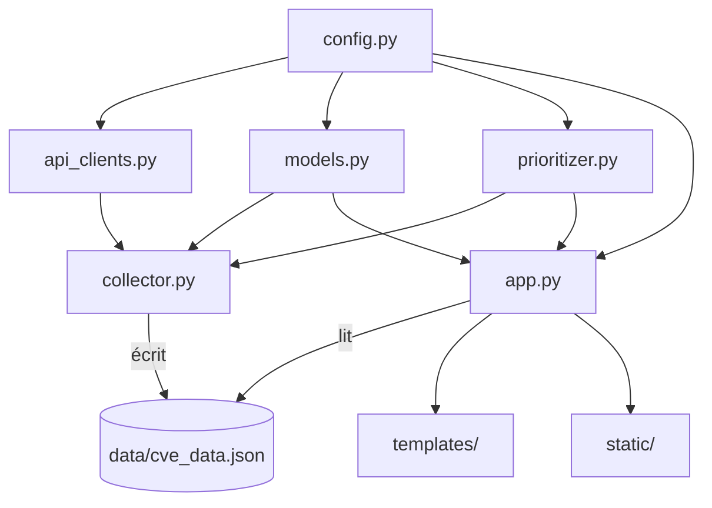
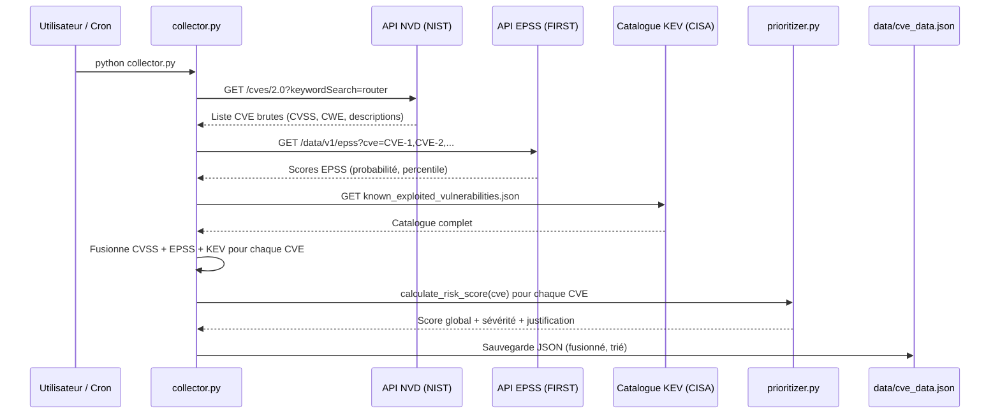
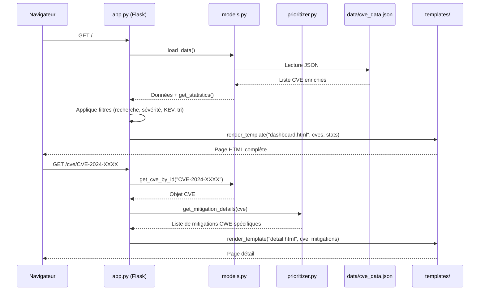
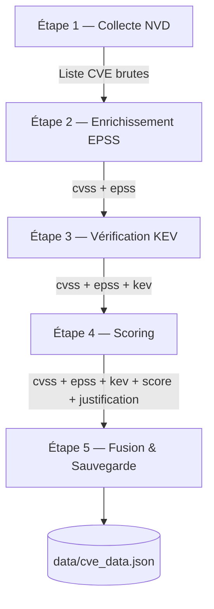

# 🛡️ IoT Shield — Architecture Technique Complète

> **Document d'architecture détaillé de la Plateforme de Priorisation des Vulnérabilités IoT**
> Périmètre : Routeurs • Stack : Python / Flask / JSON • Sources : NVD, EPSS, KEV

---

## Table des matières

1. [Vue d'ensemble](#1-vue-densemble)
2. [Arborescence du projet](#2-arborescence-du-projet)
3. [Flux de données global](#3-flux-de-données-global)
4. [Couche Configuration — `config.py`](#4-couche-configuration--configpy)
5. [Couche API — `api_clients.py`](#5-couche-api--api_clientspy)
6. [Couche Persistance — `models.py`](#6-couche-persistance--modelspy)
7. [Worker de Collecte — `collector.py`](#7-worker-de-collecte--collectorpy)
8. [Moteur de Priorisation — `prioritizer.py`](#8-moteur-de-priorisation--prioritizerpy)
9. [Serveur Web — `app.py`](#9-serveur-web--apppy)
10. [Couche Présentation — Templates & CSS](#10-couche-présentation--templates--css)
11. [Modèle de données CVE](#11-modèle-de-données-cve)
12. [Conteneurisation — Dockerfile](#12-conteneurisation--dockerfile)

---

## 1. Vue d'ensemble

IoT Shield est une plateforme web locale qui **collecte, enrichit et priorise** les vulnérabilités (CVE) affectant les routeurs. Elle s'appuie sur trois sources de données ouvertes pour produire un **Score de Risque Global** allant au-delà du simple CVSS.

### Principe fondamental

```
CVSS seul ≠ suffisant pour décider de la priorité
```

Le CVSS mesure l'**impact technique** d'une vulnérabilité, mais il ne dit rien sur :
- **La probabilité réelle d'exploitation** → c'est le rôle de l'EPSS
- **L'exploitation active en cours** → c'est le rôle du catalogue KEV

La plateforme combine ces trois dimensions pour donner une vision réaliste du risque.

### Stack technique

| Composant | Technologie | Rôle |
|-----------|-------------|------|
| Backend | Python 3.9+ | Logique métier, APIs |
| Framework web | Flask 3.x | Serveur HTTP, routage, templates |
| Client HTTP | Requests 2.x | Appels aux APIs externes |
| Stockage | JSON fichier plat | Persistance locale (pas de BDD) |
| Templates | Jinja2 | Rendu HTML côté serveur |
| Frontend | HTML5 + CSS vanilla | Interface utilisateur |
| Conteneur | Docker | Reproductibilité |

---

## 2. Arborescence du projet

```
ProjetIoT/
│
├── app.py                  # Point d'entrée Flask — Serveur web & routes
├── config.py               # Constantes globales & paramètres
├── api_clients.py          # 3 clients API (NVD, EPSS, KEV)
├── collector.py            # Script de synchronisation (exécutable seul)
├── prioritizer.py          # Moteur de scoring & justification
├── models.py               # Lecture / écriture JSON & statistiques
│
├── requirements.txt        # Dépendances Python (flask, requests)
├── Dockerfile              # Image de conteneurisation
├── README.md               # Documentation utilisateur
│
├── data/
│   └── cve_data.json       # Base de données locale (liste de CVE enrichies)
│
├── static/
│   └── style.css           # Design system (dark mode, animations)
│
└── templates/
    ├── base.html            # Layout maître (navbar, footer, flash)
    ├── dashboard.html       # Tableau de bord (stats, filtres, tableau)
    └── detail.html          # Fiche détaillée d'une CVE
```

### Relations entre modules



**Lecture du diagramme :**
- `config.py` est importé par tous les modules (constantes partagées)
- `collector.py` orchestre `api_clients.py`, `prioritizer.py` et `models.py` pour produire les données
- `app.py` lit les données et les affiche via Jinja2

---

## 3. Flux de données global

Le système fonctionne en **deux phases indépendantes** :

### Phase A — Collecte (offline, batch)



### Phase B — Affichage (online, temps réel)



> **Point clé** : le serveur web ne fait **aucun appel API externe**. Il lit uniquement le fichier JSON local. Cela garantit des temps de réponse rapides et une disponibilité indépendante des APIs.

---

## 4. Couche Configuration — `config.py`

Fichier central de paramétrage. Toutes les constantes sont définies ici et importées par les autres modules.

### Constantes définies

| Groupe | Variable | Valeur | Rôle |
|--------|----------|--------|------|
| **Chemins** | `BASE_DIR` | `os.path.dirname(__file__)` | Racine du projet |
| | `DATA_DIR` | `BASE_DIR/data` | Répertoire de stockage |
| | `DATA_FILE` | `DATA_DIR/cve_data.json` | Fichier de données |
| **Périmètre** | `KEYWORD_SEARCH` | `"router"` | Mot-clé de recherche NVD |
| | `CPE_MATCH_STRING` | `"cpe:2.3:h:*:router:*"` | Filtre CPE (non utilisé actuellement) |
| **NVD** | `NVD_API_BASE` | `https://services.nvd.nist.gov/rest/json/cves/2.0` | Endpoint API v2 |
| | `NVD_API_KEY` | `env NVD_API_KEY` | Clé optionnelle |
| | `NVD_RESULTS_PER_PAGE` | `50` | Pagination |
| | `NVD_REQUEST_DELAY` | `6.0 sec` | Rate limit sans clé |
| | `NVD_REQUEST_DELAY_WITH_KEY` | `0.6 sec` | Rate limit avec clé |
| **EPSS** | `EPSS_API_BASE` | `https://api.first.org/data/v1/epss` | Endpoint EPSS |
| **KEV** | `KEV_URL` | `https://www.cisa.gov/.../known_exploited_vulnerabilities.json` | Catalogue JSON |
| **Scoring** | `WEIGHT_CVSS` | `0.40` | 40% du score |
| | `WEIGHT_EPSS` | `0.35` | 35% du score |
| | `WEIGHT_KEV` | `0.25` | 25% du score |
| **Seuils** | `SEVERITY_THRESHOLDS` | `CRITIQUE: 8.0, ÉLEVÉ: 6.0, MOYEN: 4.0, FAIBLE: 0.0` | Classification |
| **Flask** | `FLASK_HOST` | `0.0.0.0` | Écoute sur toutes les interfaces |
| | `FLASK_PORT` | `5000` | Port HTTP |
| | `MAX_CVE_FETCH` | `200` | Plafond de collecte |

### Variable d'environnement supportée

- `NVD_API_KEY` — Clé API NVD (accélère la collecte de 6s → 0.6s entre les requêtes)
- `FLASK_DEBUG` — Active/désactive le mode debug Flask (`"true"` / `"false"`)

---

## 5. Couche API — `api_clients.py`

Trois classes encapsulent les interactions avec les APIs externes. Chacune utilise `requests.Session()` pour la réutilisation des connexions TCP.

---

### 5.1 `NVDClient` — API NVD (NIST)

**Rôle** : Récupérer les CVE liées aux routeurs avec leurs scores CVSS et catégories CWE.

| Méthode | Signature | Description |
|---------|-----------|-------------|
| `__init__` | `()` | Initialise la session avec clé API optionnelle, calcule le délai de rate limiting |
| `fetch_cves` | `(keyword=None, max_results=None) → list[dict]` | Récupère les CVE avec pagination automatique |
| `_parse_cve` | `(cve_item) → dict` | *(statique)* Extrait les champs d'un objet CVE NVD brut |

#### Mécanisme de pagination

```
Requête 1 : startIndex=0, resultsPerPage=50
Requête 2 : startIndex=50, resultsPerPage=50
...
Arrêt quand : startIndex >= totalResults OU len(all_cves) >= max_results
```

Entre chaque requête : `time.sleep(6.0)` (ou `0.6` avec clé API).

#### Parsing CVSS (`_parse_cve`)

La méthode tente d'extraire le score CVSS dans cet ordre de priorité :
1. `cvssMetricV31` — CVSS v3.1 (le plus récent)
2. `cvssMetricV30` — CVSS v3.0
3. `cvssMetricV2` — CVSS v2.0 (fallback)

Si aucune métrique n'est disponible, `cvss_score = 0.0`.

#### Extraction CWE

Les CWE sont filtrées pour exclure les entrées non informatives :
- `NVD-CWE-noinfo` → exclu
- `NVD-CWE-Other` → exclu

#### Objet retourné par `_parse_cve`

```python
{
    "id": "CVE-2024-XXXXX",
    "description": "...",
    "cvss_score": 9.8,
    "cvss_vector": "CVSS:3.1/AV:N/AC:L/...",
    "cvss_version": "3.1",
    "cwe": ["CWE-78", "CWE-787"],
    "references": ["https://..."],  # max 5
    "published": "2024-01-15T...",
    "epss_score": 0.0,      # rempli plus tard
    "epss_percentile": 0.0,  # rempli plus tard
    "kev": False,             # rempli plus tard
    "kev_date_added": "",     # rempli plus tard
    "risk_score": 0.0,        # rempli plus tard
    "severity": "",            # rempli plus tard
    "justification": "",       # rempli plus tard
}
```

> **Choix de conception** : L'objet CVE est initialisé avec des valeurs par défaut pour tous les champs enrichis. Cela évite les `KeyError` dans les étapes suivantes du pipeline.

---

### 5.2 `EPSSClient` — API EPSS (FIRST)

**Rôle** : Obtenir la probabilité qu'une CVE soit exploitée dans les 30 prochains jours.

| Méthode | Signature | Description |
|---------|-----------|-------------|
| `__init__` | `()` | Initialise la session HTTP |
| `get_scores` | `(cve_ids: list[str]) → dict` | Récupère les scores EPSS par batch de 100 |

#### Batching

L'API EPSS accepte jusqu'à 100 CVE par requête sous forme de paramètre CSV :

```
GET /data/v1/epss?cve=CVE-2024-0001,CVE-2024-0002,...,CVE-2024-0100
```

Le client découpe automatiquement les listes > 100 en plusieurs batches avec un délai de 1 seconde entre chaque.

#### Retour

```python
{
    "CVE-2024-0001": {"epss": 0.853, "percentile": 0.98},
    "CVE-2024-0002": {"epss": 0.012, "percentile": 0.45},
    ...
}
```

- `epss` : probabilité (0.0 à 1.0) que la CVE soit exploitée dans les 30 jours
- `percentile` : rang par rapport à toutes les CVE connues

---

### 5.3 `KEVClient` — Catalogue KEV (CISA)

**Rôle** : Vérifier si une CVE est activement exploitée selon la CISA.

| Méthode | Signature | Description |
|---------|-----------|-------------|
| `__init__` | `()` | Initialise l'URL, le cache à `None` |
| `_load_catalog` | `() → None` | Télécharge le JSON KEV une seule fois (lazy loading) |
| `check_cves` | `(cve_ids: list[str]) → dict` | Vérifie la présence de chaque CVE |

#### Stratégie de cache (lazy loading)

```python
def _load_catalog(self):
    if self._catalog is not None:  # Déjà chargé → skip
        return
    # Télécharge le JSON complet (~1000+ entrées)
    # Construit un dict {cve_id: date_added} pour lookup O(1)
```

Le catalogue est téléchargé **une seule fois** lors du premier appel à `check_cves()`. Les appels suivants utilisent le cache en mémoire. C'est un pattern de **lazy initialization**.

#### Retour

```python
{
    "CVE-2024-0001": {"kev": True, "date_added": "2024-01-15"},
    "CVE-2024-0002": {"kev": False, "date_added": ""},
}
```

---

## 6. Couche Persistance — `models.py`

Gère la lecture/écriture du fichier JSON et fournit des fonctions utilitaires.

### Fonctions

| Fonction | Signature | Description |
|----------|-----------|-------------|
| `ensure_data_dir` | `() → None` | Crée `data/` avec `os.makedirs(exist_ok=True)` |
| `load_data` | `() → list[dict]` | Lit `cve_data.json`, retourne `[]` si absent ou corrompu |
| `save_data` | `(cve_list: list[dict]) → None` | Écrit la liste au format JSON indenté (UTF-8) |
| `get_cve_by_id` | `(cve_id: str) → dict | None` | Recherche linéaire par ID |
| `get_statistics` | `(data=None) → dict` | Calcule les compteurs et moyennes |

### Gestion défensive des erreurs

```python
try:
    data = json.load(f)
except (json.JSONDecodeError, IOError) as e:
    logger.error(...)
    return []  # Jamais de crash, retour dégradé
```

Ce pattern est appliqué à la fois en lecture et en écriture : le système ne plante jamais à cause du fichier JSON.

### Statistiques retournées par `get_statistics`

```python
{
    "total": 142,
    "critique": 12,
    "eleve": 35,
    "moyen": 58,
    "faible": 37,
    "kev_count": 8,
    "avg_cvss": 6.42,
    "avg_epss": 0.0891,
}
```

Ces statistiques alimentent les 6 cartes compteurs du dashboard.

---

## 7. Worker de Collecte — `collector.py`

Script exécutable indépendamment avec `python collector.py`. Il orchestre le pipeline complet en **5 étapes séquentielles**.

### Pipeline `run_sync()`



| Étape | Action | Module utilisé |
|-------|--------|----------------|
| 1 | Récupérer les CVE depuis NVD | `NVDClient.fetch_cves()` |
| 2 | Ajouter les scores EPSS à chaque CVE | `EPSSClient.get_scores()` |
| 3 | Vérifier la présence dans le catalogue KEV | `KEVClient.check_cves()` |
| 4 | Calculer le score de risque global + justification | `calculate_risk_score()`, `get_severity()`, `generate_justification()` |
| 5 | Fusionner avec les données existantes + sauvegarder | `load_data()`, `save_data()` |

### Logique de fusion (Étape 5)

```python
# Les nouvelles CVE écrasent les anciennes (mise à jour)
for cve in cves:           # CVE fraîchement collectées
    merged.append(cve)
for cve in existing:        # CVE déjà en base
    if cve["id"] not in new_ids:  # Seulement si pas dans la nouvelle collecte
        merged.append(cve)

# Tri décroissant par score de risque
merged.sort(key=lambda c: c.get("risk_score", 0), reverse=True)
```

**Résultat** : les CVE les plus critiques apparaissent en premier dans le fichier JSON et donc en premier dans le dashboard.

### Modes d'exécution

1. **Manuel (CLI)** : `python collector.py`
2. **Via l'interface web** : bouton "Synchroniser" → `POST /sync` → lancé dans un `threading.Thread` en arrière-plan
3. **Automatique** : planifiable via `cron` (ex: `0 */6 * * * cd /app && python collector.py`)

---

## 8. Moteur de Priorisation — `prioritizer.py`

C'est le **cœur algorithmique** du projet. Il contient 4 fonctions.

### 8.1 `calculate_risk_score(cve) → float`

Formule du **Score de Risque Global** (0 à 10) :

```
Score = CVSS × 0.40 + (EPSS × 10) × 0.35 + KEV_bonus × 0.25
```

| Facteur | Poids | Échelle d'entrée | Normalisation | Justification |
|---------|-------|-------------------|---------------|---------------|
| CVSS | 40% | 0–10 | Aucune | Mesure l'impact technique intrinsèque |
| EPSS | 35% | 0–1 | × 10 → 0–10 | Mesure la probabilité d'exploitation réelle |
| KEV | 25% | booléen | 10 si True, 0 sinon | Signal binaire fort : exploitation active confirmée |

**Exemples de calcul** :

| Scénario | CVSS | EPSS | KEV | Score |
|----------|------|------|-----|-------|
| CVE critique, exploitée | 9.8 | 0.90 | ✅ | `9.8×0.4 + 9.0×0.35 + 10×0.25 = 3.92 + 3.15 + 2.5 = 9.57` |
| CVE haute, non exploitée | 8.0 | 0.10 | ❌ | `8.0×0.4 + 1.0×0.35 + 0×0.25 = 3.2 + 0.35 + 0 = 3.55` |
| CVE moyenne, dans KEV | 5.5 | 0.05 | ✅ | `5.5×0.4 + 0.5×0.35 + 10×0.25 = 2.2 + 0.175 + 2.5 = 4.88` |
| CVE faible | 3.0 | 0.001 | ❌ | `3.0×0.4 + 0.01×0.35 + 0×0.25 = 1.2 + 0.0035 + 0 = 1.20` |

> **Observation** : Une CVE avec CVSS moyen mais présente dans le KEV est remontée significativement. C'est le comportement souhaité : l'exploitation active prime sur l'impact théorique.

### 8.2 `get_severity(risk_score) → str`

Classification en 4 niveaux :

| Score | Sévérité |
|-------|----------|
| ≥ 8.0 | `CRITIQUE` |
| ≥ 6.0 | `ÉLEVÉ` |
| ≥ 4.0 | `MOYEN` |
| < 4.0 | `FAIBLE` |

L'itération se fait **dans l'ordre décroissant** du dictionnaire `SEVERITY_THRESHOLDS`, donc le premier seuil dépassé est retourné.

### 8.3 `generate_justification(cve) → str`

Génère un texte structuré en **5 blocs** :

```
① Niveau de risque → emoji + label + score /10
② Analyse CVSS    → impact (critique/élevé/modéré/faible) selon seuils 9.0/7.0/4.0
③ Statut KEV      → 🚨 si actif, avec date d'ajout CISA
④ Analyse EPSS    → probabilité (%) avec seuils 50%/10%/1%
⑤ Recommandations → actions concrètes adaptées à la sévérité
⑥ Conformité      → références ETSI EN 303 645 et NISTIR 8259A
```

Les recommandations varient selon la sévérité :
- **Critique / Élevé** : patch urgent, segmentation réseau, désactivation services, IDS/IPS
- **Moyen** : patch planifié, audit ACL, MFA
- **Faible** : maintenance standard, documentation

### 8.4 `get_mitigation_details(cve) → list[dict]`

Retourne des mesures de mitigation **spécifiques aux CWE** détectées.

Table de mapping CWE → mitigation (12 CWE couvertes) :

| CWE | Type | Mitigation proposée |
|-----|------|---------------------|
| CWE-78 | Injection de commandes OS | Validation des entrées, listes blanches |
| CWE-79 | XSS | Encodage sorties, CSP headers |
| CWE-89 | Injection SQL | Requêtes paramétrées |
| CWE-119 | Buffer overflow | Patch, ASLR/DEP, mise à jour firmware |
| CWE-120 | Copie tampon | Mise à jour firmware, segmentation |
| CWE-200 | Divulgation d'info | Désactiver services info |
| CWE-287 | Auth incorrecte | SSH + clés, désactiver Telnet, MFA |
| CWE-352 | CSRF | Jetons anti-CSRF |
| CWE-400 | DoS | Rate limiting, protection anti-DoS |
| CWE-416 | Use-after-free | Patch firmware |
| CWE-476 | NULL pointer deref | Mise à jour firmware |
| CWE-787 | Out-of-bounds write | Patch constructeur, segmentation |

Si aucun CWE n'est connu ou si CVSS ≥ 7.0, une mitigation **générique** est ajoutée (ACL, CoPP, Syslog, désactivation Telnet/HTTP/SNMPv1).

---

## 9. Serveur Web — `app.py`

Application Flask avec 4 routes.

### Routes

| Route | Méthode | Fonction | Template | Description |
|-------|---------|----------|----------|-------------|
| `/` | GET | `dashboard()` | `dashboard.html` | Tableau de bord principal |
| `/cve/<cve_id>` | GET | `detail(cve_id)` | `detail.html` | Fiche détaillée d'une CVE |
| `/sync` | POST | `sync()` | *(redirect)* | Lance la collecte en arrière-plan |
| `/api/stats` | GET | `api_stats()` | *(JSON)* | Statistiques en JSON |

### Route `/` — Dashboard

Le dashboard supporte 4 paramètres de filtrage via query string :

| Paramètre | Type | Exemple | Effet |
|-----------|------|---------|-------|
| `search` | string | `?search=buffer` | Filtre par ID CVE ou mot dans la description |
| `severity` | enum | `?severity=CRITIQUE` | Filtre par niveau de sévérité |
| `kev_only` | flag | `?kev_only=1` | N'affiche que les CVE dans le catalogue KEV |
| `sort` | enum | `?sort=cvss` | Tri par `risk_score`, `cvss`, `epss`, ou `id` |
| `order` | enum | `?order=asc` | Sens du tri : `asc` ou `desc` |

**Chaîne de traitement** :
```
load_data() → filtre search → filtre severity → filtre KEV → tri → render
```

> **Note** : Les statistiques sont toujours calculées sur la **totalité des données** (pas sur les données filtrées), pour que les cartes de compteurs restent cohérentes.

### Route `/cve/<cve_id>` — Détail

1. Appelle `get_cve_by_id(cve_id)` → recherche linéaire dans le JSON
2. Si non trouvé → flash message d'erreur + redirect vers le dashboard
3. Appelle `get_mitigation_details(cve)` → mitigations spécifiques CWE
4. Rend `detail.html` avec les données CVE et les mitigations

### Route `/sync` — Synchronisation

```python
def sync():
    thread = threading.Thread(target=_run_sync, daemon=True)
    thread.start()
    flash("Synchronisation lancée en arrière-plan...")
    return redirect(url_for("dashboard"))
```

**Choix** : la synchronisation est lancée dans un **thread daemon** pour ne pas bloquer le serveur web. L'utilisateur est redirigé immédiatement avec un flash message. La collecte s'exécute en arrière-plan (plusieurs minutes possibles).

---

## 10. Couche Présentation — Templates & CSS

### 10.1 Hiérarchie des templates

```
base.html              ← Layout maître
├── dashboard.html      ←  + bloc content
└── detail.html         ←  + bloc content
```

### 10.2 `base.html` — Layout maître

Structure :
- **Navbar** fixe (sticky) avec glassmorphism (`backdrop-filter: blur(20px)`)
  - Logo + titre "IoT Shield"
  - Badge "Routeurs"
  - Bouton "Synchroniser" (formulaire POST)
- **Zone flash messages** (info/error, auto-close après 5 sec)
- **Bloc content** (remplacé par les pages filles)
- **Footer** avec liens vers NVD, EPSS, KEV + mentions conformité

### 10.3 `dashboard.html` — Tableau de bord

**Section 1 — Cartes statistiques** (grille 6 colonnes responsive) :
- Total CVE, Critiques, Élevées, Moyennes, Faibles, Dans KEV
- Chaque carte a un liseré coloré en haut et un effet hover avec élévation

**Section 2 — Barre de filtres** :
- Champ de recherche full-width
- Sélecteur de sévérité (dropdown)
- Sélecteur de tri (risk_score, cvss, epss, id)
- Sélecteur d'ordre (asc/desc)
- Toggle "KEV uniquement" (checkbox stylisée)
- Boutons Appliquer / Réinitialiser

**Section 3 — Tableau des CVE** :
- 8 colonnes : ID, Score Global, Sévérité, CVSS, EPSS, KEV, Description, Action
- Score Global affiché avec une **barre de progression colorée** (rouge/orange/jaune/vert)
- Badges de sévérité avec bordures colorées et animation pulse pour KEV
- Description tronquée à 120 caractères
- Lien "Détails →" vers la fiche

**État vide** : si aucune CVE, icône flottante animée + invitation à synchroniser

### 10.4 `detail.html` — Fiche détaillée

**Section 1 — En-tête** : CVE ID (gradient), badges sévérité + KEV, date de publication

**Section 2 — 4 cartes de scores** (grille) :
- **Score Global** : jauge SVG circulaire animée (cercle `stroke-dasharray` proportionnel)
- **CVSS** : score + version + vector string
- **EPSS** : score en % + barre de progression + label
- **KEV** : statut OUI/NON + date d'ajout si applicable

**Section 3 — Description technique** : texte complet de la CVE

**Section 4 — Tags CWE** : badges cliquables vers cwe.mitre.org

**Section 5 — Analyse du risque** : texte `pre` avec `white-space: pre-wrap` — rendu de `generate_justification()`

**Section 6 — Mitigations** : cartes avec barre latérale cyan, label CWE, titre, détail

**Section 7 — Conformité** : grille 2 colonnes ETSI / NISTIR avec listes d'exigences + liens

**Section 8 — Références** : liens externes vers les advisories

### 10.5 Design System CSS — `style.css`

| Aspect | Choix |
|--------|-------|
| **Mode** | Dark mode exclusif |
| **Police** | Inter (Google Fonts) — 300 à 800 |
| **Palette** | Tons bleu/violet/cyan sur fond quasi-noir (`#0a0e1a`) |
| **Glassmorphism** | Navbar avec `backdrop-filter: blur(20px)` + fond semi-transparent |
| **Badges** | Bordures colorées semi-transparentes + fond teinté à 15% |
| **Animations** | `pulse-glow` (badges KEV), `float` (icône vide), `slideDown` (flash messages), hover transitions |
| **Responsive** | 3 breakpoints : `>768px`, `480-768px`, `<480px` — grille adaptative |

---

## 11. Modèle de données CVE

Chaque enregistrement CVE dans `data/cve_data.json` a la structure suivante :

```json
{
  "id": "CVE-2024-20356",
  "description": "A vulnerability in the web-based management interface of Cisco...",
  "cvss_score": 9.8,
  "cvss_vector": "CVSS:3.1/AV:N/AC:L/PR:N/UI:N/S:U/C:H/I:H/A:H",
  "cvss_version": "3.1",
  "cwe": ["CWE-78"],
  "references": [
    "https://sec.cloudapps.cisco.com/security/center/content/CiscoSecurityAdvisory/...",
    "https://nvd.nist.gov/vuln/detail/CVE-2024-20356"
  ],
  "published": "2024-04-24T20:15:07.123",
  "epss_score": 0.853,
  "epss_percentile": 0.982,
  "kev": true,
  "kev_date_added": "2024-05-02",
  "risk_score": 9.57,
  "severity": "CRITIQUE",
  "justification": "⚠️ PRIORITÉ CRITIQUE (Score : 9.57/10)\n• Impact critique (CVSS 9.8/10)..."
}
```

| Champ | Type | Source | Description |
|-------|------|--------|-------------|
| `id` | string | NVD | Identifiant CVE (ex: `CVE-2024-20356`) |
| `description` | string | NVD | Description technique en anglais (ou français si dispo) |
| `cvss_score` | float | NVD | Score CVSS base (0–10) |
| `cvss_vector` | string | NVD | Vecteur CVSS complet |
| `cvss_version` | string | NVD | Version du scoring (3.1, 3.0, 2.0) |
| `cwe` | list[string] | NVD | Catégories de faiblesse (ex: `["CWE-78"]`) |
| `references` | list[string] | NVD | URLs des advisories (max 5) |
| `published` | string | NVD | Date ISO de publication |
| `epss_score` | float | EPSS | Probabilité d'exploitation sous 30 jours (0–1) |
| `epss_percentile` | float | EPSS | Percentile parmi toutes les CVE (0–1) |
| `kev` | boolean | KEV | Présence dans le catalogue KEV CISA |
| `kev_date_added` | string | KEV | Date d'ajout au catalogue (YYYY-MM-DD) |
| `risk_score` | float | Calculé | Score de Risque Global (0–10) |
| `severity` | string | Calculé | Niveau : `CRITIQUE`, `ÉLEVÉ`, `MOYEN`, `FAIBLE` |
| `justification` | string | Calculé | Texte explicatif multi-lignes |

---

## 12. Conteneurisation — Dockerfile

```dockerfile
FROM python:3.11-slim       # Image de base légère (~150 MB)
WORKDIR /app
RUN apt-get update && apt-get install -y --no-install-recommends curl
COPY requirements.txt .
RUN pip install --no-cache-dir -r requirements.txt
COPY . .
RUN mkdir -p /app/data
EXPOSE 5000
ENV FLASK_DEBUG=false
ENV PYTHONUNBUFFERED=1
CMD ["python", "app.py"]
```

| Directive | Raison |
|-----------|--------|
| `python:3.11-slim` | Image légère, sans outils de compilation inutiles |
| `--no-cache-dir` | Réduit la taille de l'image (pas de cache pip) |
| `PYTHONUNBUFFERED=1` | Les logs apparaissent immédiatement dans `docker logs` |
| `FLASK_DEBUG=false` | Désactive le debug en production (pas de reloader) |
| `curl` | Installé pour les health checks Docker (`curl localhost:5000`) |

### Commandes Docker

```bash
# Build
docker build -t iot-shield .

# Run (standard)
docker run -p 5000:5000 iot-shield

# Run avec clé NVD + volume persistant pour les données
docker run -p 5000:5000 \
  -e NVD_API_KEY="ma-clé" \
  -v $(pwd)/data:/app/data \
  iot-shield

# Lancer la collecte dans le conteneur
docker exec -it <container_id> python collector.py
```
